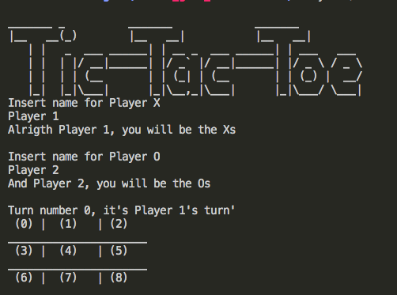
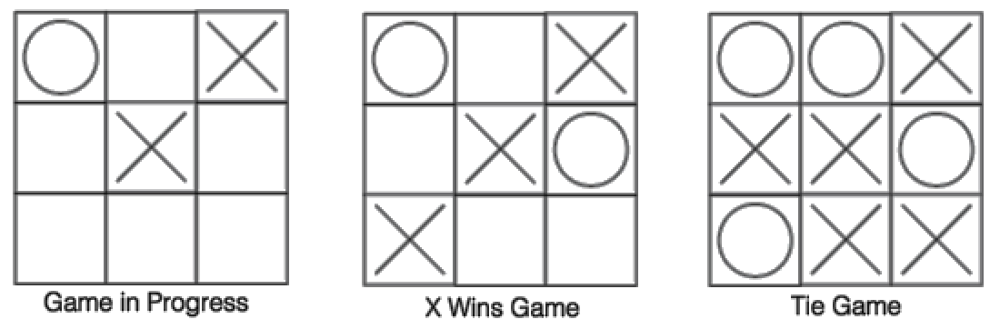

# Tic-Tac-Toe

A tic-tac-toe terminal game for two players

## Built With

- Ruby

## Live Demo

- [Live Demo Link](https://repl.it/@SunnyDiaz/Tic-Tac-Toe#bin/main)

## Getting Started

- Please go to the provided live demo link, or 
- Download the code from repository (https://github.com/SunnySparks/Tic-Tac-Toe) and execute the main file from your terminal, more detailed instructions below.

### How to play tic-tac-toe

- 1 The game is played on a grid that's 3 squares by 3 squares.

- 2 Player 1 is X, your friend (player 2 in this case) is O. Players take turns putting their marks in empty squares.

- 3 The first player to get 3 of their marks in a row (up, down, across, or diagonally) is the winner.

- 4 When all 9 squares are full, the game is over. If no player has 3 marks in a row, the game ends in a tie.

### Prerequisites for demo link

- Browser
- Internet

### Instructions for demo link

- 1 Go to the demo link previously provided
- 2 On the right side of the screen type ruby bin/main
- 3 Follow the instructions on the screen, Type the name of the player 1 
- 4 Type the name of player 2
- 5 Introduce the desired numbers (From 1 to 9) on the board for each player
- 6 Have fun!

### Prerequisites for usage in terminal

- Internet access
- Repository link
- Terminal 

### Instructions for usage in terminal

- 1 Clone this repository to your computer
- 2 Open your terminal
- 3 Drag and drop the folder containing the cloned repository into your terminal
- 4 type the command 'bin/main' in your terminal
- 5 Type the name of the player 1
- 6 Type the name of player 2
- 7 Introduce the desired numbers (From 1 to 9) on the board for each player
- 8 Have fun!

## Authors

👤 **José Francisco Silva Díaz** AKA **Sunny Díaz**

- Github: [@SunnySparks](https://github.com/sunnySparks)
- Twitter: [@JosFranT6](https://twitter.com/josfrant6)
- Linkedin: [linkedin](https://www.linkedin.com/in/josé-francisco-silva-díaz-a2a9421a6)

👤 **Mariana Atenais Campos García**
- Github: [@atenaiis] (https://github.com/atenaiis)
- Twitter :  [@spranomarian] (https://twitter.com/spranomarian)
- Linkedin: [linkedin]https://www.linkedin.com/in/mariana-atenai-campos-garcia-a30791143/

## Show your support

Give a ⭐️ if you like this project! and feel free to leave any feedback.

## Acknowledgments

In this project there were many discoveries regarding the usage of ruby classes and methods, it helped us understand better the way they work and how to implement them. 
